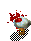
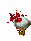

# goodbye-checkerboard

Removes checkboard shadow from bmp files, and converts them to png.

Created for [JugglingDink](https://www.dinknetwork.com/user/JugglingDink/) in response to [this request](https://www.dinknetwork.com/forum.cgi?MID=205618).

## Instructions

1. Download the [Release](release/).
2. Copy GoodbyeCheckerboard.exe to a folder that contains .bmp files.
3. Run GoodbyeCheckerboard.exe, and it will remove checkerboard shadows and convert the images to pngs.

## Example

Before:

After:

This lovely artwork was donated by those wonderful guys from www.rtsoft.com (@SethRobinson).